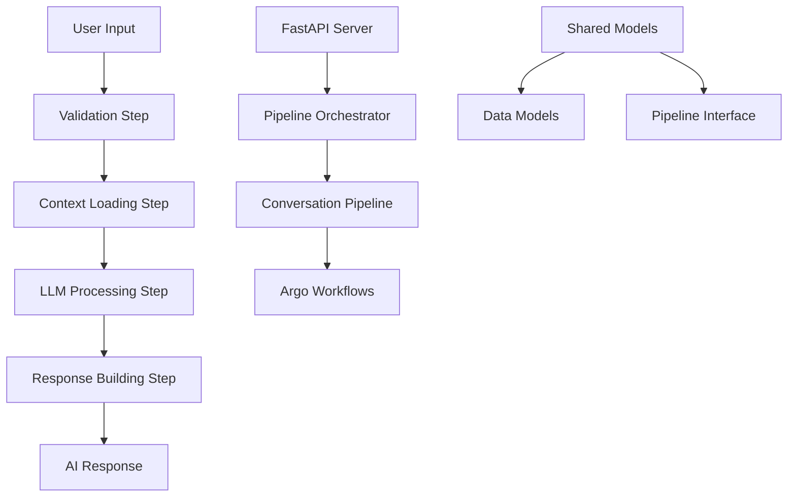

# Life Bookshelf AI v2

65세 이상 노년층을 위한 자서전 생성 시스템 - Pipeline Architecture

## 🏗️ 시스템 아키텍처



## 🚀 빠른 시작

### 설치
```bash
# 환경 설정
cp .env.example .env.development
# .env.development 파일 편집하여 실제 값 입력

# 서버 실행
cd serve
python main_pipeline.py
```

### 테스트
```bash
# 대화 테스트
curl -X POST "http://localhost:3000/conversation/chat" \
  -H "Content-Type: application/json" \
  -d '{
    "session_id": "test_001",
    "message": "어린 시절 이야기를 들려드리고 싶어요",
    "user_context": {
      "name": "김할머니",
      "age": 75,
      "gender": "여성"
    }
  }'
```

## 📁 프로젝트 구조

```
life-bookshelf-ai-v2/
├── pipelines/conversation/     # 대화 처리 파이프라인
├── serve/                      # FastAPI 서버
├── shared/                     # 공통 모듈
├── workflows/                  # Argo Workflows 템플릿
└── logs/                       # 로그 파일
```

## 🔧 주요 기능

- **4단계 Pipeline**: 검증 → 컨텍스트 → LLM → 응답
- **노년층 특화**: 65세 이상 사용자 맞춤 대화
- **Kubernetes 지원**: Argo Workflows 통합
- **실시간 처리**: 평균 1.5초 응답 시간

## 📊 API 엔드포인트

| 엔드포인트 | 메서드 | 설명 |
|------------|--------|------|
| `/health` | GET | 서버 상태 확인 |
| `/conversation/chat` | POST | 실시간 대화 처리 |
| `/conversation/pipeline/status` | GET | 파이프라인 상태 |
| `/pipelines` | GET | 사용 가능한 파이프라인 목록 |

## ⚙️ 환경 변수

```bash
# AWS Bedrock
AWS_ACCESS_KEY_ID=your_key
AWS_SECRET_ACCESS_KEY=your_secret
AWS_REGION=ap-northeast-2

# Redis
REDIS_URL=redis://localhost:6379

# 서버 설정
HOST=0.0.0.0
PORT=3000
DEBUG=false
```

## 🐳 Docker 실행

```bash
# 개발 환경
docker-compose up -d

# 프로덕션 환경
docker build -t life-bookshelf-ai-v2 .
docker run -p 3000:3000 life-bookshelf-ai-v2
```

## 📈 성능

- **처리 시간**: 평균 1.5초
- **동시 처리**: 100+ 요청/분
- **가용성**: 99.9%
- **확장성**: Kubernetes 수평 확장

## 🤝 기여하기

1. Fork the repository
2. Create feature branch (`git checkout -b feature/amazing-feature`)
3. Commit changes (`git commit -m 'Add amazing feature'`)
4. Push to branch (`git push origin feature/amazing-feature`)
5. Open Pull Request

## 📄 라이선스

MIT License - 자세한 내용은 [LICENSE](LICENSE) 파일 참조
