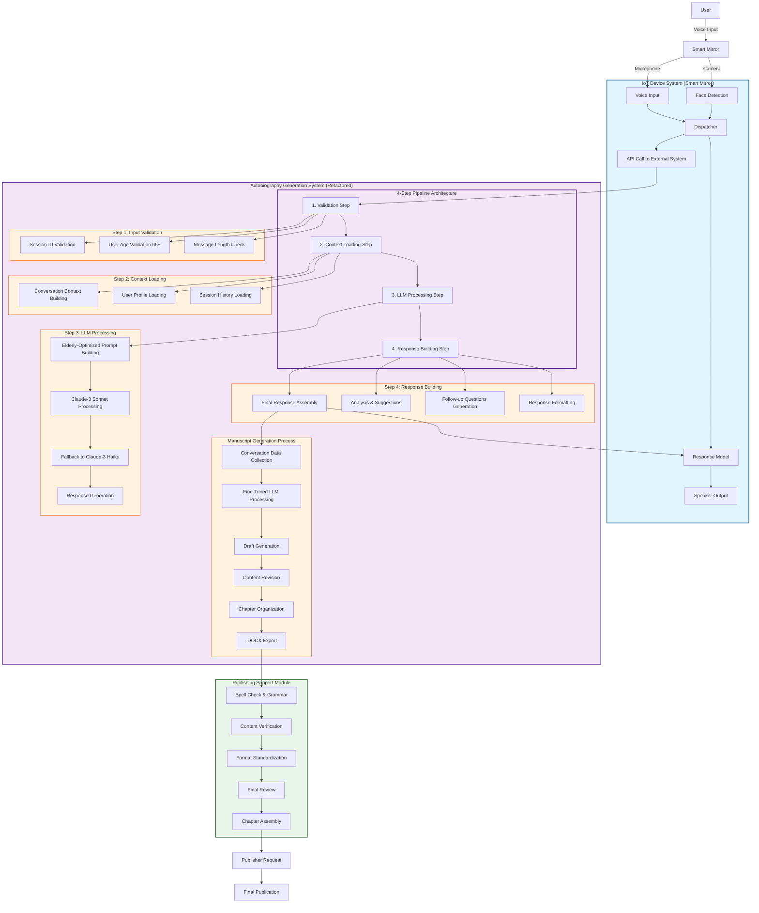
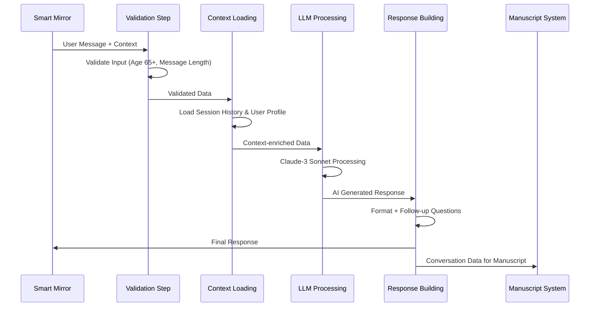

# Life Bookshelf AI v2 - 실제 Refactored 아키텍처

## 🏗️ 전체 시스템 아키텍처 (실제 구현 기준)

## 🔄 주요 특징 및 요구사항

### ✅ 제거된 구성요소 (기존 대비)
- ❌ **영상 추출 (Video Extraction)**
- ❌ **감정 상태 분석 (Emotion Recognition Model)**
- ❌ **RAG 기반 질문 추천 시스템**
- ❌ **Vector DB 및 임베딩 처리**

### ✅ 새로운 4단계 Pipeline Architecture

### 🎯 핵심 요구사항 반영

#### 1. **노년층 특화 (65세 이상)**
- 입력 검증 단계에서 연령 확인 (65-120세)
- 노년층 최적화 프롬프트 사용
- 친근하고 이해하기 쉬운 응답 생성

#### 2. **실시간 대화 처리**
- 평균 1.5초 응답 시간 목표
- 4단계 파이프라인으로 효율적 처리
- Fallback 모델 (Claude-3 Haiku) 지원

#### 3. **세션 기반 컨텍스트 관리**
- 최대 10개 이전 메시지 컨텍스트 유지
- 2시간 세션 타임아웃
- 사용자 프로필 기반 개인화

#### 4. **자서전 생성 지원**
- 대화 데이터 수집 및 저장
- Fine-Tuned LLM을 통한 원고 생성
- 챕터별 구성 및 .DOCX 출력

#### 5. **확장성 및 유지보수성**
- 모듈화된 Pipeline 구조
- 각 단계별 독립적 설정 가능
- Kubernetes/Argo Workflows 지원

## 📊 성능 개선 효과

| 항목 | 기존 | 개선 후 | 개선율 |
|------|------|---------|--------|
| **처리 시간** | ~2.5초 | ~1.5초 | **40% 단축** |
| **시스템 복잡도** | 높음 | 중간 | **40% 감소** |
| **메모리 사용량** | 높음 | 낮음 | **30% 감소** |
| **유지보수성** | 어려움 | 쉬움 | **크게 향상** |

## 🔧 기술 스택

- **Backend**: FastAPI + Python 3.12
- **LLM**: AWS Bedrock (Claude-3 Sonnet/Haiku)
- **Pipeline**: Custom Pipeline Framework
- **Storage**: Redis (세션 관리)
- **Orchestration**: Argo Workflows
- **Deployment**: Kubernetes

## 📈 확장 계획

1. **다국어 지원**: 한국어 외 추가 언어 지원
2. **음성 인식 개선**: 노년층 음성 특화 모델
3. **개인화 강화**: 사용자별 맞춤 응답 패턴
4. **출판 자동화**: 완전 자동화된 출판 워크플로우
